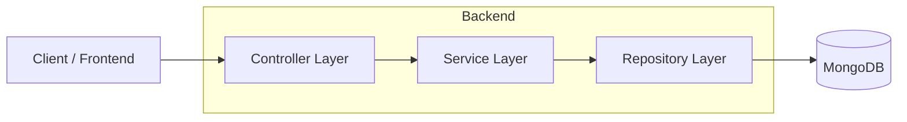
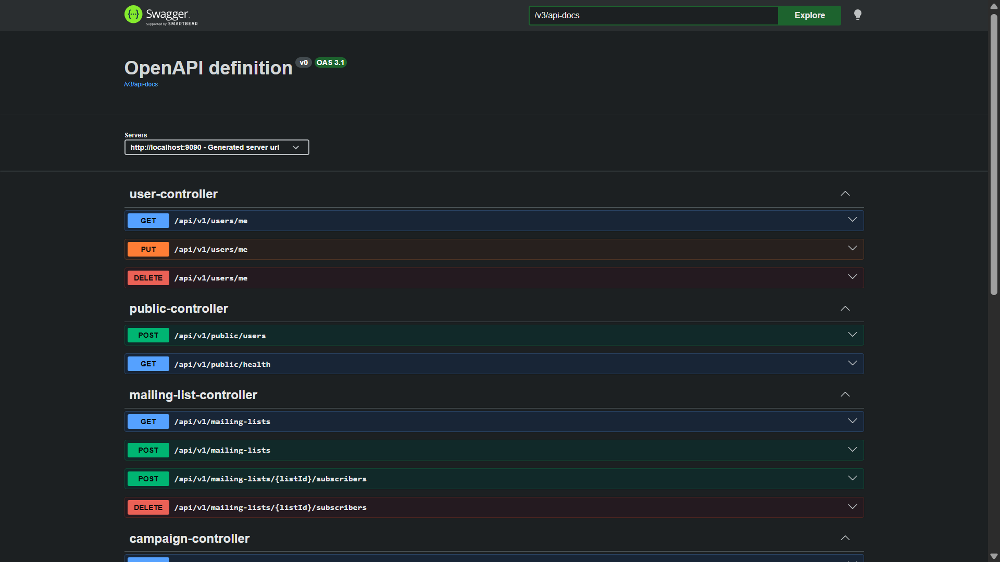
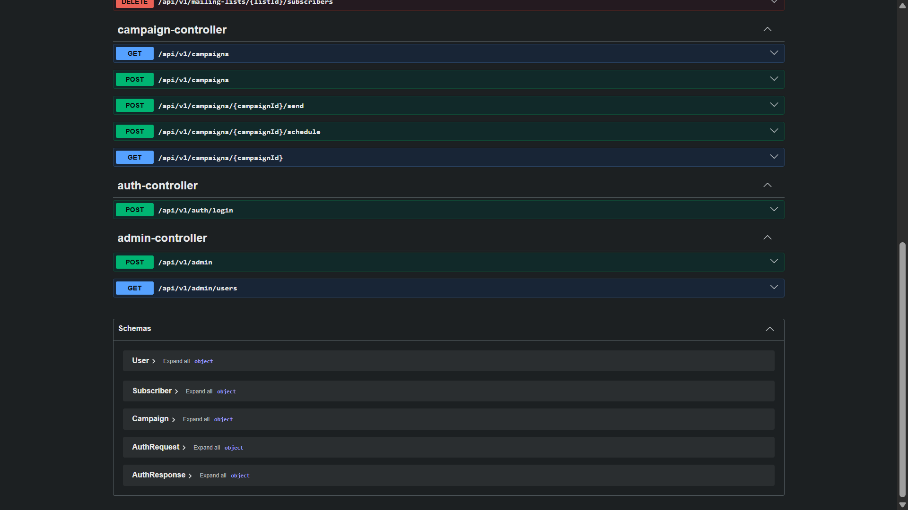

# 📧 TrueReach — Newsletter & Email Campaign Manager API

A **secure, scalable, and production-style backend API** for managing mailing lists, creating email campaigns, and scheduling deliveries.

Built with **Java, Spring Boot, and MongoDB**, this project demonstrates real-world backend engineering practices including authentication, pagination, filtering, and layered architecture.

---

## 🏗️ Architecture



---

## 🚀 Features

### 🔐 Authentication & Security

* JWT-based authentication
* BCrypt password hashing
* Role-based access control (User/Admin)

### 📋 Mailing List Management

* Create and manage mailing lists
* Add/remove subscribers

### 📝 Campaign Management

* Create campaigns
* Schedule campaigns
* Send campaigns (mocked via logs)

### 🔎 Filtering & Pagination

* Filter campaigns by status (`DRAFT`, `SCHEDULED`, `SENT`)
* Paginated responses for scalability

### 👑 Admin Controls

* Manage users
* Create admin accounts

---

## 🔨 Tech Stack

| Layer    | Technology                    |
| -------- | ----------------------------- |
| Backend  | Java, Spring Boot, Maven      |
| Security | Spring Security, JWT, BCrypt  |
| Database | MongoDB (Spring Data MongoDB) |
| API Docs | Swagger (OpenAPI), Postman    |

---

## 📂 Project Structure

```
TrueReach/
├── src/
│   ├── main/
│   │   ├── java/com/guvi/projects/TrueReach
│   │   │   ├── config/       
│   │   │   ├── controller/   
│   │   │   ├── dto/          
│   │   │   ├── impl/         
│   │   │   ├── model/        
│   │   │   ├── repo/         
│   │   │   ├── service/      
│   │   └── resources/
│   │       ├── application.properties
```

---

## ⚡ Getting Started

### Prerequisites

* Java 17+
* Maven
* MongoDB

---

### Installation

```bash
git clone https://github.com/Soumyajit173/TrueReach.git
cd TrueReach
mvn clean install
mvn spring-boot:run
```

---

## 📘 API Documentation

### 🔹 Swagger UI (Local)

```
http://localhost:8080/swagger-ui/index.html
```

## 📘 API Specification

👉 **[`openapi.json`](./openapi.json)**

## 📬 Postman Collection

You can import and test all APIs using Postman:

👉 [`TrueReach_API_v1_(JWT).postman_collection.json`](./TrueReach_API_v1_(JWT).postman_collection.json)

### Steps:
1. Open Postman  
2. Click Import  
3. Upload the JSON file  
4. Start testing APIs  

You can import this into:
- Postman
- Swagger Editor

---

## 📡 API Endpoints

### 🔐 Auth

**Login**
`POST /api/v1/auth/login`

```json
{
  "email": "admin@a.org",
  "password": "admin"
}
```

---

### 🌐 Public APIs

**Health Check**
`GET /api/v1/public/health`

**Register User**
`POST /api/v1/public/users`

```json
{
  "name": "testuser",
  "password": "123456",
  "email": "test@t.in"
}
```

---

### 👤 Users

* `GET /api/v1/users/me`
* `PUT /api/v1/users/me`
* `DELETE /api/v1/users/me`

---

### 📋 Mailing Lists

* `POST /api/v1/mailing-lists?name=AdminList`
* `GET /api/v1/mailing-lists`
* `POST /api/v1/mailing-lists/{listId}/subscribers`
* `DELETE /api/v1/mailing-lists/{listId}/subscribers`

---

### 📝 Campaigns

* `POST /api/v1/campaigns`
* `GET /api/v1/campaigns?page=0&size=5`
* `GET /api/v1/campaigns/{campaignId}`
* `POST /api/v1/campaigns/{campaignId}/send`
* `POST /api/v1/campaigns/{campaignId}/schedule`
* `GET /api/v1/campaigns?status=SCHEDULED&page=0&size=5`

---

## 📊 Sample Response

```json
{
  "campaigns": [...],
  "currentPage": 0,
  "totalItems": 12,
  "totalPages": 3,
  "pageSize": 5
}
```

---

## 🔒 Security Highlights

* JWT authentication for secure access
* BCrypt password encryption
* Role-based authorization

---

## 🧠 Key Concepts Demonstrated

* REST API design
* Pagination with Spring Data
* Filtering using query parameters
* Layered architecture (Controller → Service → Repository)
* Secure backend development

---

## 🔮 Future Improvements

* Real email service integration (SMTP / APIs)
* Campaign analytics dashboard
* Search functionality
* Role-based access control (RBAC enhancements)
* Cloud deployment (Render / AWS)

---

## 📸 Screenshots




```
docs/images
```

---

## 🌍 Live API

You can access the deployed application here:

👉 https://truereach.onrender.com/swagger-ui/index.html#/

### 🔹 Hosted Swagger UI
Explore and test APIs directly:

👉 https://truereach.onrender.com/swagger-ui/index.html#/

---

## 👨‍💻 Author

**Soumyajit Nandi**
GitHub: https://github.com/Soumyajit173

---

## ⭐ Support

If you found this project useful, consider giving it a ⭐ on GitHub!
